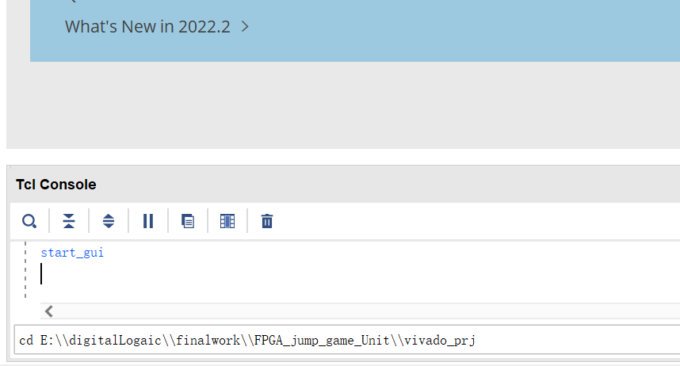
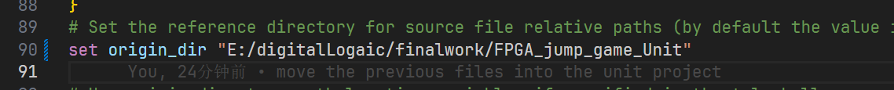
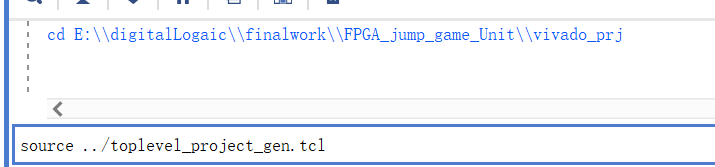
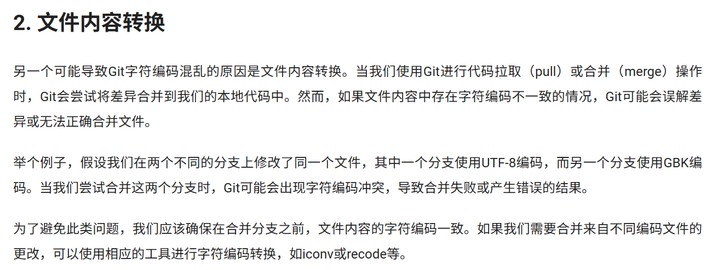
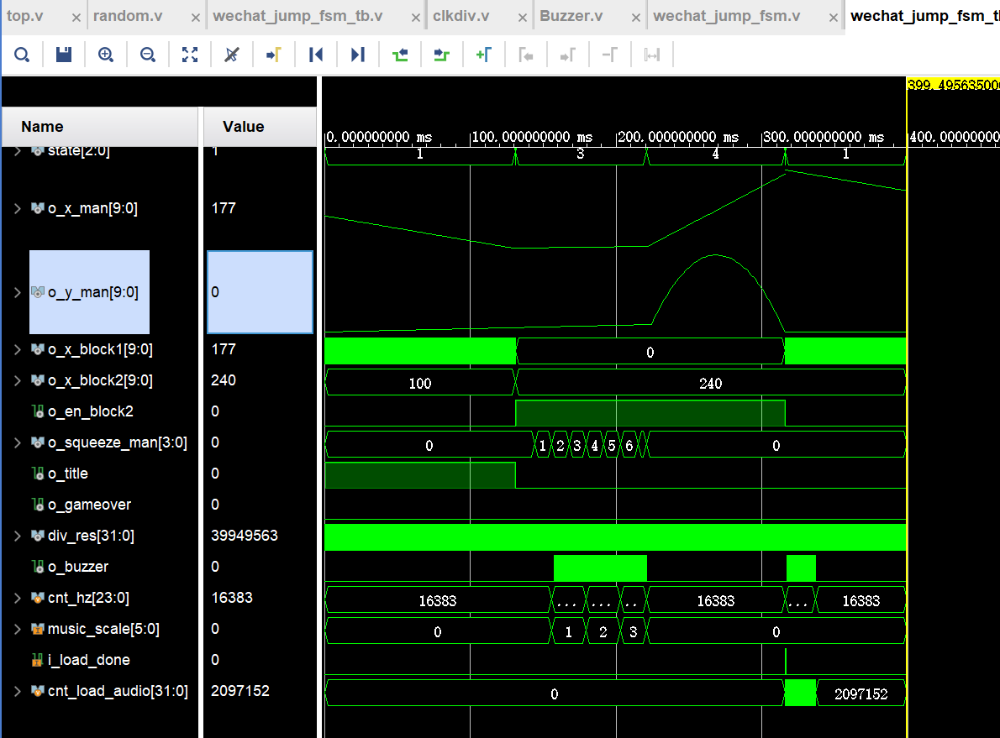
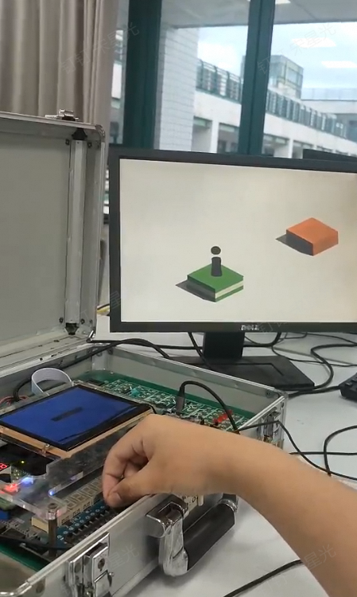
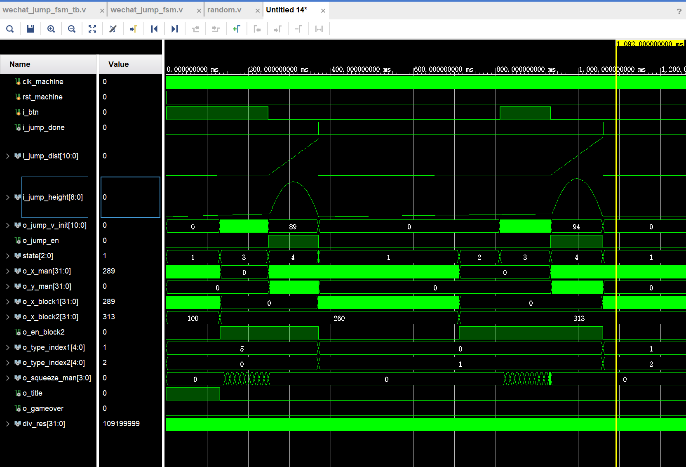

<link rel="stylesheet" href="https://cdnjs.cloudflare.com/ajax/libs/font-awesome/6.0.0-beta3/css/all.min.css">

# FPGA_jump_game

## 前言
如果你需要使用这个项目仓库的话，请先在你的vscode下载git graph插件，你可以在网上查看教程，学会如何把这个项目下载到本地，以及如何使用git graph这个插件。

#### 如何利用tcl文件生成vivado工程

你可以参考https://zhuanlan.zhihu.com/p/6522301675 这篇文章，学会使用vivado的tcl命令来构建vivado工程和生成项目重构文件。

例如 想要利用tcl文件生成vivado工程，你需要先cd到vivado_prj文件夹内，你需要修改成你的本地路径。



另一方面，你需要把tcl文件中的srogin_dir改成本地的路径



然后在vivado命令行中执行下述指令，就可以生成vivado工程了。其中"../"代表上一级目录



执行之后就可以在vivado_prj生成vivado工程了。

#### 如何创建新的vivado工程重构文件

在tcl控制台运行下述指令，就可以生成新的vivado工程重构文件。
write_project_tcl -force 后面填写toplevel_project_gen.tcl文件路径

指令中-force是强制覆盖已有的文件，如果没有这个参数，则会报错。

## 现阶段进度

#### <i class="fas fa-calendar-alt" style="color: darkblue;"></i> 2025.06.10

---


---

上面的图片来自[Git教程；什么会导致Git对字符编码产生混乱](https://geek-docs.com/git/git-questions/202_git_what_can_cause_git_to_mess_with_character_encoding.html)，乱码问题是在进行merge时导致的。解决方法就是merge的时候小心一点，要保证文件编码方式相同，如果还不行，就只能自己手动merge了。或许还有什么办法可以修改git的编码方式，这我还不知道。我先用.gitattributes文件来尝试解决这个问题。

当然，一般情况下，如果想之间在远程的origin/main分支基础上进行工作的话，可以直接reset curent branch到origin/main，然后再checkout到新的分支进行工作。不过这样可能会导致你丢失一些本地的修改，因此这样做的前提是，你当前并没有做什么修改。参考链接：[知乎：VSCode_Git_操作（rebase+revert+reset）](https://zhuanlan.zhihu.com/p/69286730)

#### <i class="fas fa-calendar-alt" style="color: darkblue;"></i> 2025.06.08

注意：我在vivado工程添加了新的文件，你需要把他们手动添加到你的工程中。新的重构文件已经生成，你也可以使用它来重构你的工程。

在本项目的两人合作下，问题3（小人会被锁定到箱子正中心）已经解决。同时，我还加入了简单的计分系统，每当小人成功跳过一个箱子，就加1分。


从波形图可以看出o_x_man的曲线是连续的，不会像之前一样出现突变问题。

另一方面，我修改了传入jump模块的时钟，使得jump的过程减慢，也就是说，小人跳跃的动画播放得更慢了。同时，我修改了wechat_jump_fsm中o_jump_v_init和o_squeeze_man取值方式，这使得小人压缩过程和跳跃速度的增加这两个过程变得更慢了。准确来说，要想获得与原本相同的跳跃初速度，按键按下的时间需要是原来的两倍。

简单的计分系统： 通过diaplay_score模块在四位七段数码管上显示得分。score长度为10bit，最高得分是1023。从仿真波形图中可以看出，当小人成功跳过一个箱子时，score会加1。但是因为我仿真的时候控制不好小人得压缩程度，总是在第二次的时候失败。```ಥ_ಥ```也许下板的时候会简单一点吧。

我明天（6.9）去试一下看看下板结果是否正常。如果正常的话，就可以开始写报告了。```\^o^/```


#### <i class="fas fa-calendar-alt" style="color: darkblue;"></i> 2025.06.04
4和5已经解决。下图是wechat_jump_fsm的仿真结果



从图中的o_buzzer可以看出i_load_done出现一个高电平信号时，o_buzzer会有一段时间的方波信号，这段时间内蜂鸣器会发出声音。但是声音的频率可能需要根据下板的结果进行调整。

另一方面，这次我修改了Buzzer模块的代码，使其发出声音的频率能根据squeeze_man的大小变化快速发生改变，换句话就是降低了它们之间的延迟。然而，具体的效果还需要等到下板的时候看看。

还有就是，新的vivado工程重构文件已经生成。当然，你不需要使用它重构vivado工程。因为你可以直接把toplevel_source/ip/img_fameover_mark导入到你的项目中。

~~注意：vivado在toplevel_source/ip/img_gameover_mark这个文件夹下面好像存放了一些综合结果，这导致这个文件夹比较大，我暂时也不知道怎么解决这个问题。~~

删除线对应的问题已解决，解决方式是我现在本地的另一个vivado工程创建ip，然后把生成的ip放到/toplevel_source/ip/img_gameover_mark这里。之后导入到本项目的vivado工程中。这样新生成的缓存文件就会放在工程自己的文件夹中，这些缓存文件就不会被git记录。

#### <i class="fas fa-calendar-alt" style="color: darkblue;"></i> 2025.06.02

下板结果正常，但是存在一下几个问题：

1. 随机生成的箱子2的位置还不太合适
2. 有时候拨动开关没反应
3. 现在小人会被锁定到箱子正中心，这一点需要改进
4. 小人落到箱子上没有音效
5. 游戏结束这四个字的图片还没有做蒙版(这个简单，只不过还没做)
6. 我想的是应该刚开始显示跳一跳标题，玩家按键之后小人移动的指定位置并开始游戏。结束的时候玩家再次按键重新开始游戏(视频是使用了单独的复位键)




#### <i class="fas fa-calendar-alt" style="color: darkblue;"></i> 2025.06.01 
现在wechat_jump_fsm的仿真结果正常，如下图所示


<i class="fas fa-exclamation-triangle" style="color: red;"></i> 但是，每个阶段的持续时间需要根据实际情况进行调整，这要等到下板的时候才能确定。

